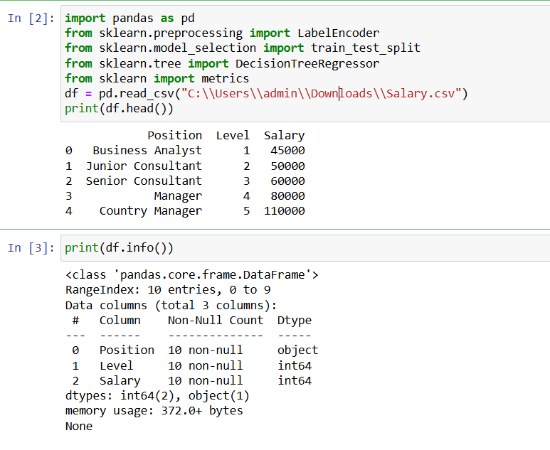
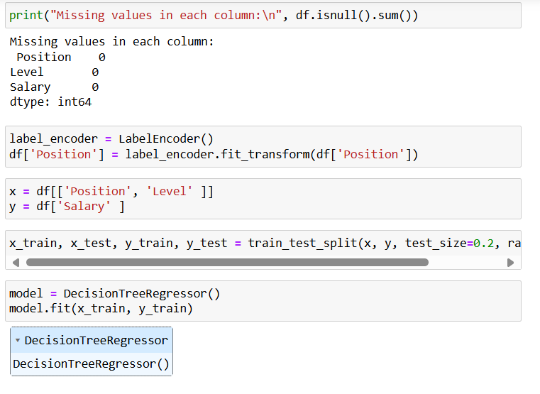
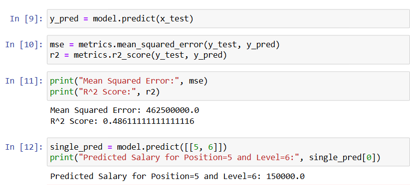

# Implementation-of-Decision-Tree-Regressor-Model-for-Predicting-the-Salary-of-the-Employee

## AIM:
To write a program to implement the Decision Tree Regressor Model for Predicting the Salary of the Employee.

## Equipments Required:
1. Hardware – PCs
2. Anaconda – Python 3.7 Installation / Jupyter notebook

## Algorithm
1. Import required libraries
2. Load the salary data from CSV
3. Check data and handle missing values
4. Convert 'Position' to numbers using Label Encoding
5. Set features (Position, Level) and target (Salary)
6. Split data into training and test sets.
7. Train a Decision Tree Regressor model
8. Predict salaries on test data.
9. Evaluate the model (MSE and R² Score). 10.Predict salary for a given Position and Level.

## Program:
```
Program to implement the Decision Tree Regressor Model for Predicting the Salary of the Employee.
Developed by: PRAGATHI KUMAR
RegisterNumber: 212224230200
```
```
import pandas as pd
from sklearn.preprocessing import LabelEncoder
from sklearn.model_selection import train_test_split
from sklearn.tree import DecisionTreeRegressor
from sklearn import metrics
df = pd.read_csv("C:\\Users\\admin\\Downloads\\Salary.csv")
print(df.head())
print(df.info())
print("Missing values in each column:\n", df.isnull().sum())
label_encoder = LabelEncoder()
df['Position'] = label_encoder.fit_transform(df['Position'])

x = df[['Position', 'Level' ]]
y = df['Salary' ]

x_train, x_test, y_train, y_test = train_test_split(x, y, test_size=0.2, random_state=2)

model = DecisionTreeRegressor()
model.fit(x_train, y_train)
y_pred = model.predict(x_test)
mse = metrics.mean_squared_error(y_test, y_pred)
r2 = metrics.r2_score(y_test, y_pred)
print("Mean Squared Error:", mse)
print("R^2 Score:", r2)
single_pred = model.predict([[5, 6]])
print("Predicted Salary for Position=5 and Level=6:", single_pred[0])

```

## Output:





## Result:
Thus the program to implement the Decision Tree Regressor Model for Predicting the Salary of the Employee is written and verified using python programming.
